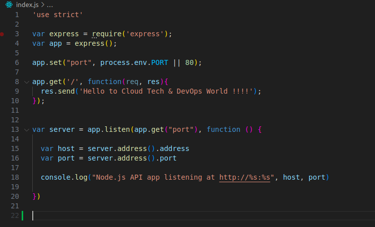
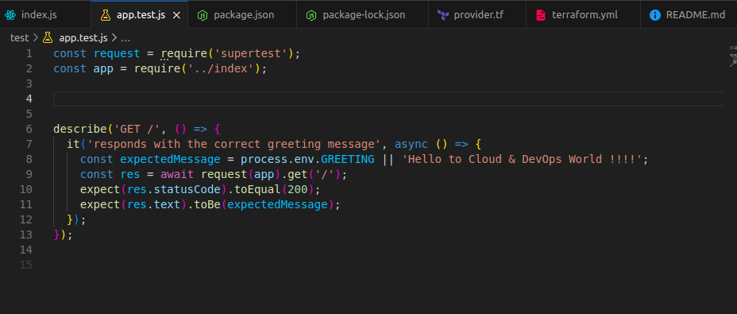
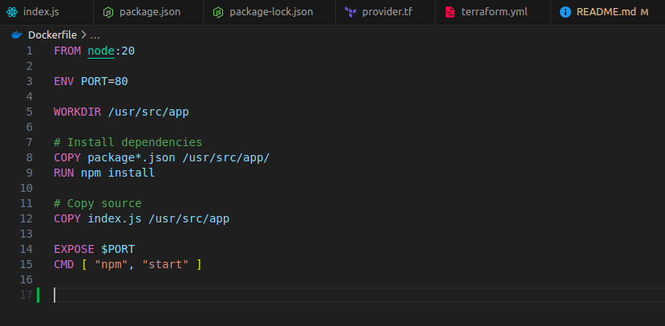
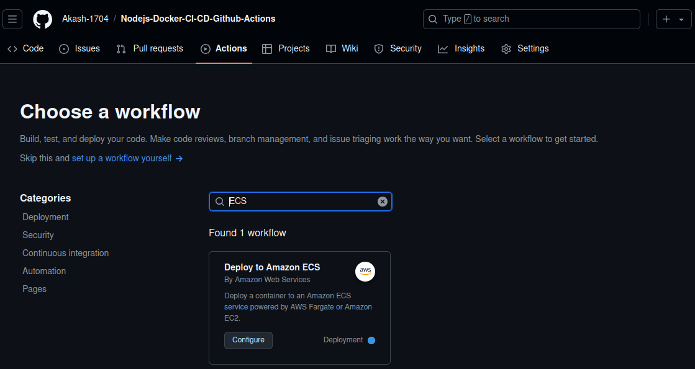
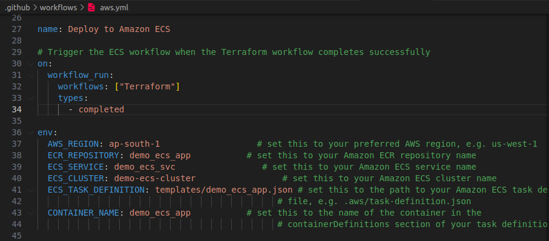
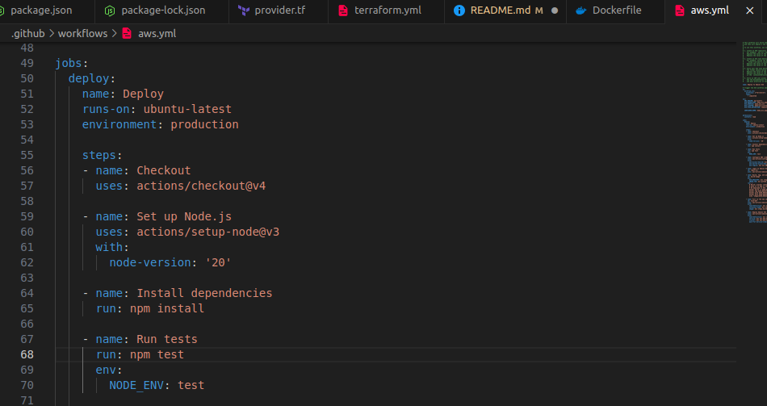
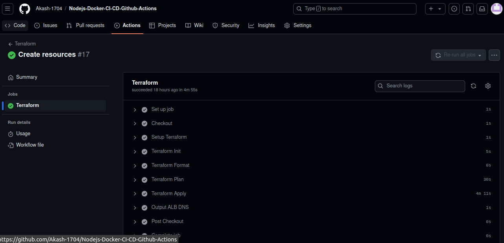
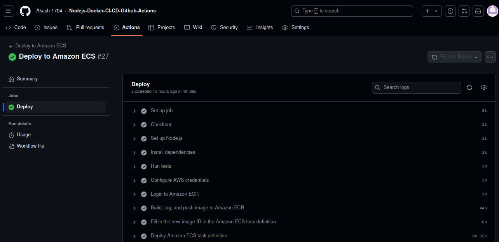
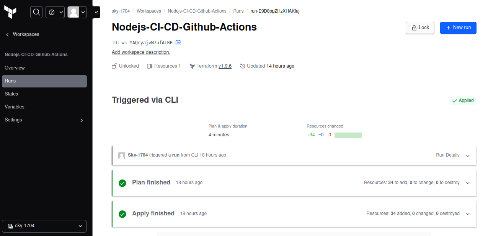

### ECS Fargate Terraform Deployment Pipeline

This project automates deployment of a Node.js web application using GitHub Actions, ECS Fargate, and Terraform. Changes pushed to the GitHub repository trigger Docker image builds and uploads to ECR. The Terraform workflow manages AWS infrastructure like ECS clusters, VPCs, load balancers, and security groups. GitHub Actions workflows handle both infrastructure provisioning and application deployment, ensuring efficient delivery through Terraform Cloud and ECS Fargate. The pipeline updates ECS task definitions and redeploys with the latest image automatically.

### Prerequisites

* GitHub repository for the application code.
* Terraform Cloud account for running Terraform code.
* IAM user with Admin access for accessing AWS resources via Terraform.
* AWS credentials (Access Key ID & Secret Access Key) and Terraform API token stored securely as GitHub repository secrets.

### Setup Instructions

#### Initialize the project & create index.js with a basic endpoint on local machine.

   **Command:** `npm init -y`

  

#### Create a Test file in test directory which checks if the root endpoint (/) returns the expected message  

   

   Install testing dependencies supertest and jest:

   **Command:** `npm install --save-dev jest supertest`

   
   To run the test, use the command:

   **Command:** `npm test`

   

#### Run the below commands to Install Dependencies & Run the Application locally.

   **Command:** `npm install`

   **Command:** `npm start`

   

   http://localhost:80 (Test your application on a browser)

#### Create Dockerfile for our application as shown below

   

   **FROM node:20:** We are using the official Node.js version 20 image for our application

   **ENV PORT=80:** This sets the environment variable PORT to 80. This is useful for making our code dynamic and to use this in our index.js setup.

   **WORKDIR /usr/src/app:** This sets the working directory inside the container to /usr/src/app. All subsequent commands will be run in this directory.

   **COPY package.json /usr/src/app/:** This copies only the package*.json files to the container. It allows you to install dependencies (npm install) without copying unnecessary files.

   **RUN npm install:** This installs the dependencies using package.json which was copied earlier, this step will only re-run if dependencies change, optimizing the Docker build process.

   **COPY index.js /usr/src/app:** This copies your source code(index.js) to the container.

   **EXPOSE $PORT:** This exposes the port set by the PORT environment variable (which defaults to 80).

   **CMD [ "npm", "start" ]:** This runs the start script from our package.json.

#### Create a workspace in Terraform Cloud account and configure API-driven workflow.

#### Add AWS credentials as environment variables in Terraform Cloud workspace.

   

#### Generate an API token in Terraform Cloud user settings.
(Go to User settings -> Tokens and Create an API token)

#### Store AWS credentials and Terraform API token securely as GitHub repository secrets.
(Go to your Github repo -> Settings -> Secrets -> Actions. Create a new repo secrets and add IAM user’s Access key id & Secret access key along with the Terraform API token we created earlier.)

    These repository secrets will be defined in our workflows which we will create next in aws.yaml & terraform.yaml files. These workflows will use the secrets for authentication while deploying and accessing the aws infrastructure.

   

#### Configure GitHub Actions workflows for ECS and Terraform in the repository.
(Go to Actions -> New Workflow and search for ecs. Click on configure and commit this file to your main branch. Similarly, Create a workflow for terraform.)

     

  

#### GitHub Actions Workflow: Deploy to Amazon ECS

    This workflow automates the deployment of our application to Amazon ECS. It is triggered upon the successful completion of the "Terraform" workflow.

   - **Checkout:** Pulls the latest code from the repository.
   - **Node.js Setup & Tests:** Installs Node.js, dependencies, and runs tests.
   - **Docker Build & Push:** Builds a Docker image from the application code and pushes it to Amazon ECR.
   - **ECS Deployment:** Updates the ECS task definition with the new Docker image and deploys it to ECS.

    The deployment uses environment variables for configuring AWS, ECS services, clusters, and the container.

#### GitHub Actions Workflow: Terraform

    This workflow automates the deployment and management of infrastructure using Terraform.

   - **Trigger:** Runs on every push to the main branch.
   - **Checkout:** Pulls the latest code to the runner.
   - **Setup Terraform:** Installs Terraform CLI and configures credentials.
   - **Terraform Init & Format:** Initializes the working directory and checks formatting.
   - **Terraform Plan:** Generates an execution plan.
   - **Terraform Apply:** Applies changes and provisions infrastructure
   - **Terraform Destroy:** Destroys resources as a cleanup step.
   - **Output ALB DNS:** Displays the ALB DNS name after execution.

#### Edit necessary values in workflow files and create terraform configuration files of AWS resources mentioned below.

**Resources Needed**

* VPC (vpc.tf)
* Load Balancer (alb.tf)
* Security Group (sg.tf)
* IAM Role for ECS (iam.tf)
* ECS Cluster, ECS Service, ECS Task Definition & ECR Repo (ecs.tf)
* Variables (variable.tf)
* Terraform Cloud & AWS (provider.tf)

#### Update the following changes in the project files as below:

* Edit aws.yaml file (ECS workflow) and update values in the env block as per our requirement.
  Set the condition block to trigger when when the Terraform workflow completes successfully. 

    

  
* Add the Test step in your workflow:

  

* Edit terraform.yaml file (Terraform workflow) and comment out the last action for Terraform destroy. 

   

* Modify Terraform provider settings in provider.tf by replacing organisation & workspace name with your terraform cloud account details.

  

#### Push changes to the main branch to trigger workflows for deployment.

   

   

   
   

### Explanation

When we push some changes in any file to the main branch, our workflows will get triggered and start deploying our infra on AWS using Terraform & push our application’s docker image to ECR which will in turn update our ECS services as we have set the task definition to pick the latest image from our ECR.

Hence, we have created a code deployment pipeline using Github actions which is automated to get triggered whenever there’s a code change which is pushed to the main branch and a docker image will be created and pushed to ECR.

Terraform will help to create our ECS cluster on AWS using Github workflow and ECS workflow will update the container image whenever there’s a change in the main branch and update the task definition file as well.

### Verification

Access the load balancer DNS to validate changes reflected in the deployed application.

### Challenges Faced

   - **CI/CD Integration with GitHub Actions:** Ensuring the ECS and Terraform workflows ran in the correct order. I resolved this by configuring the workflows in GitHub Actions with a specific trigger that ensured the ECS deployment would only start after Terraform finished its execution, thus preventing deployment errors.

   - **Infrastructure Configuration:** Configuring the necessary AWS resources like VPC, Load Balancer, and ECS settings posed some challenges. I overcame this by breaking down the Terraform configurations into manageable files for each resource, making the infrastructure setup more organized and easier to troubleshoot.

   - **ECS Task Definition Drift in Terraform Workflow:**  I encountered an issue where Terraform was continuously updating the ECS service's task definition to an older revision, leading to drift detection and unwanted changes during workflow execution. To resolve the issue, I configured the aws_ecs_service resource in Terraform to ignore changes to the task definition attribute. This allowed the ECS workflow to update the task definition without interference from Terraform.

   - **Testing Step Challenges:** Initially, the test step in the GitHub Actions workflow failed to execute properly. After troubleshooting, I discovered that the testing dependencies were not installed correctly in the CI environment. To resolve this, I updated the workflow to ensure that the npm install command was run before executing the tests. This change ensured that all required packages were available, allowing the tests to run successfully as part of the deployment pipeline.
